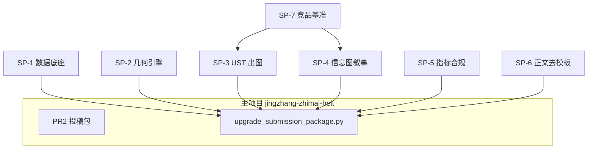

# Top1 攻关子项目拆分

> 基于对 `open-city-ai/haidian` 主分支 **923** 个投稿包的远程元数据分析（GitHub Tree API + raw 文件抽样，未整库 clone 到本机）。  
> 复验时间：2026-08-19；SAGIRIxr 五图 2252.3 KB、liunnn1994 570.8 KB、本地 PR #2 109.9 KB 与初分析一致。

## 分析准确性说明（不下载到本机是否可靠？）

| 维度 | 方法 | 可信度 | 局限 |
|------|------|--------|------|
| 包数量、文件清单 | Git tree API | **高** | 仅 main 分支已 merge 包 |
| self_check / manifest | raw JSON 批量拉取 | **高** | 字段 schema 因版本略有差异 |
| metrics 几何深度 | metrics.json 字段 | **中** | **97% 包未填** land_use_feature_count，深度排名仅 24 包可信 |
| 图面质量 | 五图 HTTP HEAD/GET 体积 | **中高** | 体积≈质量代理；不读像素语义 |
| 正文质量 | proposal.md 抽样 | **中** | 未对 923 篇全文 NLP |
| 你的 PR #2 | 本地 workspace | **高** | 未 push 到 upstream，远程搜不到 |

**结论**：生态统计（923 包、94% pass、T1 占绝大多数）**可信**；Top5 排名与图面 KB **可信**；「人审分数」仍为估计。  
持续校验：运行 `python3 scripts/benchmark_submissions.py --refresh`。

---

## 质量档位与 Top1 差距

| 档位 | 五图 KB | LU | 代表 | 你的差距 |
|------|---------|-----|------|----------|
| T1 脚手架 | ~110 | 4 | 你（PR #2） | 当前 |
| T2 信息图 | 500–800 | 15+ | liunnn1994 | 图面 ×5、几何 ×4 |
| **T3 Top1** | **1500–3500** | **48–123** | SAGIRIxr, KevinJH82 | 图面 ×20、几何 ×30、叙事一体化 |

Top1 共性：**名-图-几何-指标** 四位一体；一张总览图讲清三层+三核+命名体系；metrics 填 feature count。

---

## 子项目拆分（专项攻关 → 汇入主包）



### SP-1 数据底座（Data Foundation）

**目标**：upgraded 边界 + 天地图约束 + OSM 路网进入投稿包，fail-fast。

| 交付 | 脚本 |
|------|------|
| 前置校验 | `scripts/verify_submission_prerequisites.py` |
| 边界同步 | `scripts/sync_submission_boundary.py` |
| 约束同步 | `scripts/sync_submission_constraints.py` |
| 路网裁剪 | `scripts/clip_corridor_roads.py` |

**Top1 所需数据**：`provisional_boundaries_upgraded.geojson`、`tianditu_wfs_beijing.geojson`（LRRL/HYDL）、`osm_road_network.geojson`。

---

### SP-2 几何引擎（Geometry Engine）

**目标**：19 用地 + 16 建筑 + 5 绿 + 5 公共 + 3 分期，拓扑无 gap/overlap。

| 交付 | 脚本 |
|------|------|
| 参数化生成 | `scripts/generate_design_geometry.py --submission-dir` |
| 拓扑验收 | main() 内 gap/overlap 硬阈值 |

**对标**：SAGIRIxr LU=123（过度细分）；务实目标 **19/16/5/5/3**（test/test 深度）。

---

### SP-3 UST 出图（Figure Pipeline — 唯一路径）

**目标**：五图 ≥1200px 宽、单图 >50KB、合计 **≥800KB（T2）→ ≥1500KB（T3）**。

| 交付 | 脚本 |
|------|------|
| UST-only 渲染 | `scripts/generate_submission_figures.py` |
| 体积/尺寸门禁 | 输出后校验，不达标 exit 1 |

**环境**：`UST_ROOT` 本机 Mac；Cloud VM 在 verify 阶段停止。

---

### SP-4 信息图叙事（Infographic Narrative — Top1 差异化）

**目标**：接近 SAGIRIxr 的「一图一主叙事」— 三层框、三核 callout、命名体系、Logo 方向。

| 交付 | 内容 |
|------|------|
| 图面模板 spec | `docs/subprojects/figure-narrative-spec.md`（待 SP-7 反推） |
| 可选增强 | baoyu-infographic 排版层（在 UST 底图之上，非 fallback） |

**攻关点**：UST 负责空间真值；信息图负责 **概念框、指标卡、FIG-01 编号**（KevinJH82/SAGIRIxr 风格）。

---

### SP-5 指标与合规（Metrics & Compliance）

**目标**：metrics 填齐 feature count；与 GeoJSON 可复算；matrices 地块级引用。

| 交付 | 脚本/文件 |
|------|-----------|
| 指标复算 | upgrade pipeline 内 recalc step |
| 矩阵同步 | `compliance_matrix.json` 等随 LU/BLDG id 更新 |

**Top1 差异**：24/923 填了 metrics — 填齐即超过 97% 竞品。

---

### SP-6 正文与 Visual（Proposal De-template）

**目标**：去除脚手架话术；LU/BLDG 引用 ≥20；`visual/index.html` 用真实 metrics。

| 对标 | vanddccd 39k 字 + 27 source；SAGIRIxr agent.1–6 覆盖 |

---

### SP-7 竞品基准（Benchmark Toolkit）

**目标**：不 clone 全库，远程持续排名与反推 Top1 模式。

| 交付 | 脚本 |
|------|------|
| 远程分析 | `scripts/benchmark_submissions.py` |
| 输出 | `data/benchmark/submissions_ranking.json` |

---

## 主项目并行精进路线

```bash
# 编排入口（几何/数据可在 Cloud；UST 在本机）
python3 scripts/upgrade_submission_package.py \
  submissions/lijiaaaaa-bot/jingzhang-zhimai-belt
```

| 阶段 | 子项目 | 预期档位 |
|------|--------|----------|
| Phase 0 | SP-1 verify | 阻断缺失数据 |
| Phase 1 | SP-1 sync + SP-2 geo | T1→T2 几何 |
| Phase 2 | SP-3 UST（本机） | T2 图面 ~800KB |
| Phase 3 | SP-4 信息图 + SP-6 正文 | 接近 liunnn1994 |
| Phase 4 | SP-4 深化 + SP-5 metrics | 冲击 T3 / Top10 |
| 持续 | SP-7 benchmark | 排名跟踪 |

---

## 建议精读 Top5（远程 URL）

1. [SAGIRIxr/jingzhang-switchback-ai-belt](https://github.com/open-city-ai/haidian/tree/main/submissions/SAGIRIxr/jingzhang-switchback-ai-belt)
2. [KevinJH82/origin-city-of-agents](https://github.com/open-city-ai/haidian/tree/main/submissions/KevinJH82/origin-city-of-agents)
3. [LiuXiu233/switchback-belt-jingzhang](https://github.com/open-city-ai/haidian/tree/main/submissions/LiuXiu233/switchback-belt-jingzhang)
4. [vanddccd/verifiable-city-belt](https://github.com/open-city-ai/haidian/tree/main/submissions/vanddccd/verifiable-city-belt)
5. [liunnn1994/jingzhang-civic-ai-commons](https://github.com/open-city-ai/haidian/tree/main/submissions/liunnn1994/jingzhang-civic-ai-commons)
