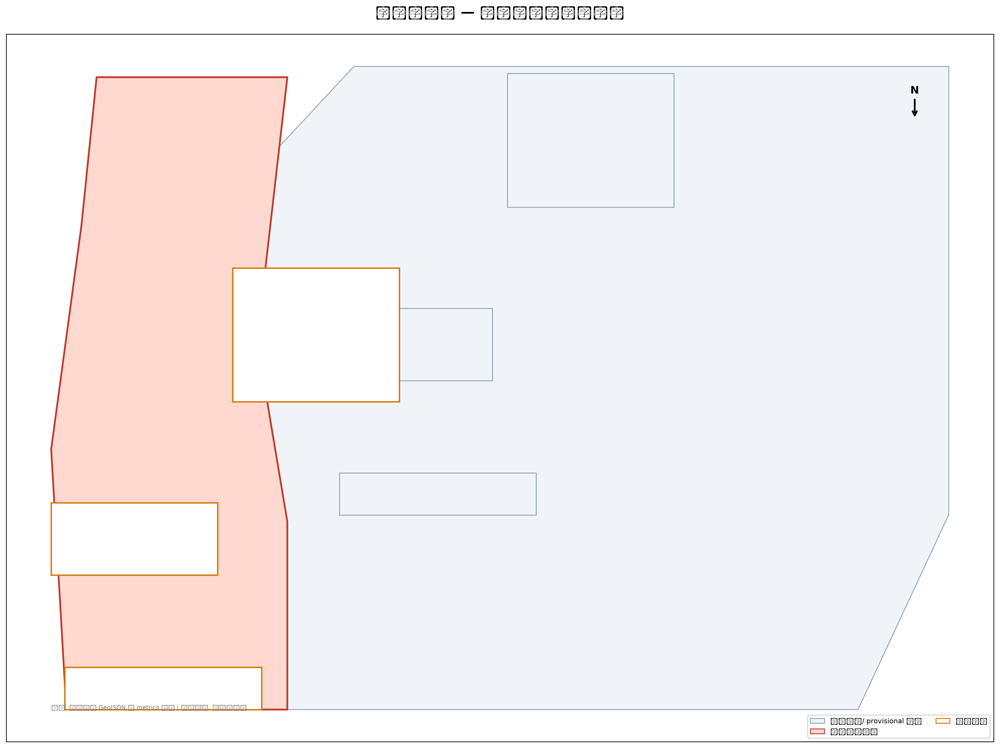
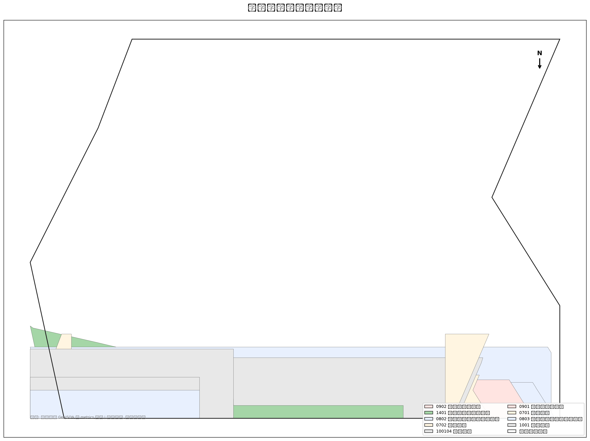
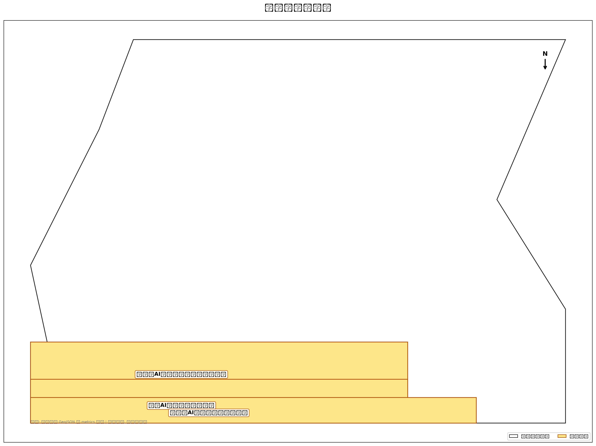
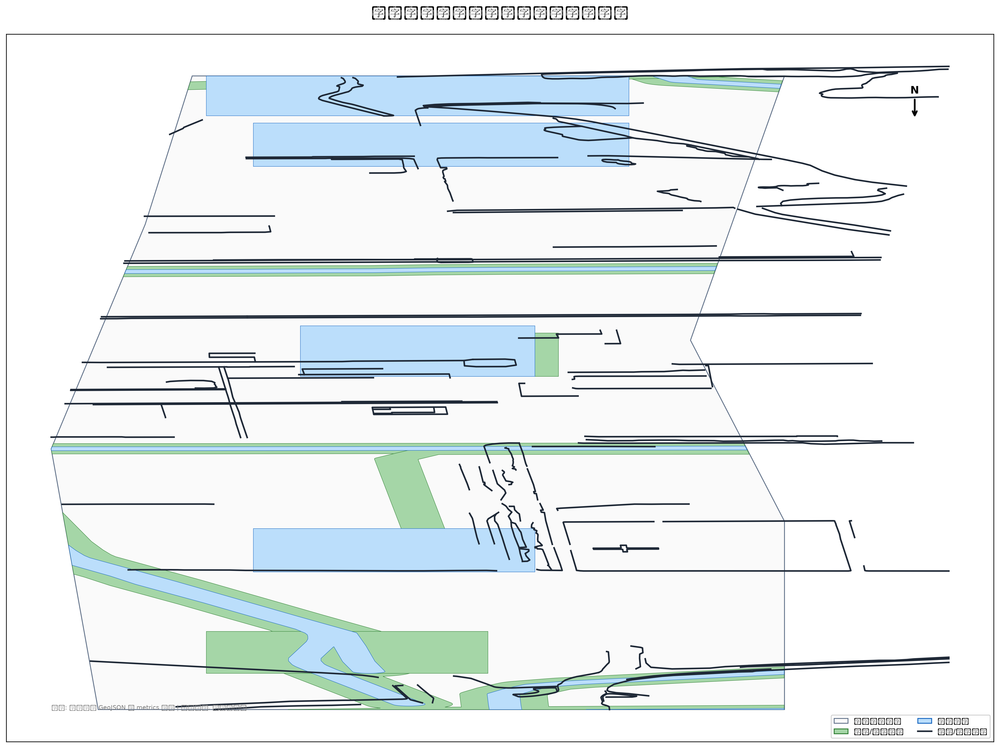
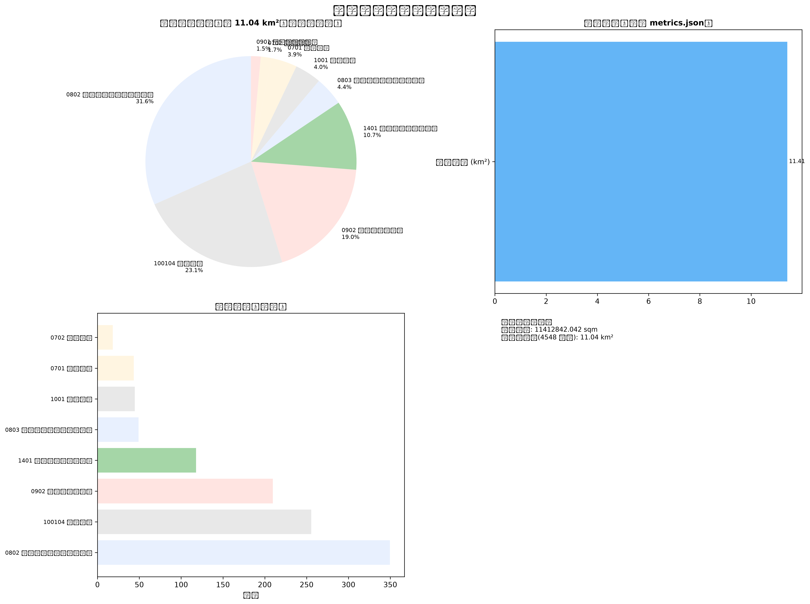

# 京张智脉共生带城市设计方案

## 设计依据与资料清单

本 formal 方案以北京市规划和自然资源委员会海淀分局发布的《百年京张AI创新带城市设计国际方案征集资格预审公告》为第一依据，并以 `brief/site-package/` 中经维护者登记的临时粗略边界、重点区域、枚举、指标和来源清单为机器可读依据。AI agent 在生成方案前必须读取 `design_brief.json`、`allowed_design_space.json`、`sources.json`、`enums/`、`ranges/`、`schemas/`、`data/source_registry.json` 和 `data/processed/agent_fact_pack.md`，并用 `project_scope_summary.csv`、`agent_task_requirements.csv`、`source_use_matrix.csv`、`missing_data_checklist.csv` 建立任务、范围、资料用途和缺口清单。所有设计判断都要拆分为可追溯来源、可复算指标、可校验图层和可人工复核假设。公告要求方案达到控制性详细规划的城市设计深度和规划综合实施方案的城市设计深度，因此文本叙述不能替代 GeoJSON、指标表、A3 文册、A0 展板和 HTML 电子展示成果。

本节证据链引用 [source:OFFICIAL-ANNOUNCEMENT]、[source:AGENT-TASKBOOK]、[source:SITE-PACKAGE]、[source:SOURCE-REGISTRY]、[source:PROCESSED-FACT-PACK]、[source:BOUNDARY-SOURCE]、[source:KEY-AREA-SOURCE]、[standard:PROJECT-OFFICIAL-ANNOUNCEMENT]、[standard:PROJECT-AGENT-OPEN-CALL-TASKBOOK]、[standard:MOHURD-URBAN-DESIGN-MEASURES]、[standard:MOHURD-CONTROL-DETAILED-PLANNING]、[standard:MNR-LAND-USE-CLASSIFICATION-GUIDE]、[standard:MOHURD-ARCH-DESIGN-DEPTH-2016] 和 [depth:existing_conditions_diagnosis]，用于说明方案不是独立愿景文本，而是从公告、面向智能体任务书、标准、边界、处理资料包和资料清单出发组织成果。

资料登记表的使用边界如下：

- data/source_registry.json 登记公开、清权与临时资料的用途边界。
- 当前登记摘要：formal 可用资料 14 条，背景资料 7 条，provisional-only 资料 1 条。
- agent 不得把 background_only 或 provisional_only 资料升级为 official boundary、法定控规、正式评分依据或政府实施承诺。

`data/processed/agent_fact_pack.md` 是本方案的阅读导航层，不是新的权威来源。[source:PROCESSED-FACT-PACK] 只帮助 agent 把三层范围、三处重点区、公告任务、agent.1-agent.6、资料可用性和缺资料事项组织成可读方案；所有事实判断仍回到 [source:OFFICIAL-ANNOUNCEMENT]、[source:AGENT-TASKBOOK]、[source:SOURCE-REGISTRY]、[source:BOUNDARY-SOURCE] 与 [source:KEY-AREA-SOURCE]。

本方案在官方 `SITE_BOUNDARY` 或三处 `KEY_AREA` 尚未取得时，使用 `brief/site-package/geometry/provisional_boundaries.geojson` 生成临时 formal 包。提交包中的 `geometry/site_boundary.geojson` 与 `geometry/key_areas.geojson` 均必须标注为 `provisional_constraint`、`official_boundary=false`，只能用于方案生成、自检、可视化和设计讨论，不能作为 official redline、审批依据、精确面积依据或法定控制结论。该组织方数据缺口本身不阻断内容评分；替换 official polygons 后，site boundary、key areas、land use、roads、green space、public space、buildings、phasing 和 metrics 均需重算。

本次提交的可评分状态为：**临时边界，保留精度警示并待正式数据发布后复算；不阻断内容评分**。因此，正文中的空间结构、场景、项目和指标均按“可讨论、可复核、可替换官方边界后重算”的原则写入；当官方边界和重点区 polygon 更新后，agent 必须重新运行脚手架、自检和图纸/HTML生成，不能只替换单个文件。

边界和重点区域的可读解释对应 [data:geometry/site_boundary.geojson#SITE-001]、[data:geometry/key_areas.geojson#PROV-KEY-001] 和 [metric:site_area_sqm]、[metric:key_area_count]。这意味着读者可以从正文回到 GeoJSON 查看边界来源、从 metrics 查看面积复算结果、从 sources 查看资料来源，而不是只相信一段文字判断。

## 三层范围工作框架

方案按照公告确定的三个层次组织工作：统筹研究范围覆盖 43.6 平方公里 AI 产业生态与创新链；总体设计范围覆盖 11.4 平方公里京张遗址公园周边城市地区；重点区域范围覆盖 368.4 公顷三处详细设计片区，分别落实功能业态、建设规模、保留与更新分类、公共空间连通和交通组织。三层范围在 `compliance_matrix.json` 中逐条映射，保证公告 1.3、1.4、1.5 与 agent.1-agent.6 的必选任务都有章节、图层、指标、图纸和 HTML 证据。

三层工作框架的深度项由 [depth:three_level_scope_framework] 和 [depth:overall_spatial_structure] 约束，空间证据以 [data:geometry/site_boundary.geojson#SITE-001] 与 [data:geometry/key_areas.geojson#PROV-KEY-001] 为准，任务依据以 [standard:PROJECT-OFFICIAL-ANNOUNCEMENT] 为准，范围索引以 [source:PROCESSED-FACT-PACK] 中 `project_scope_summary.csv` 的三层范围表为导航。

三层工作不是互相割裂的图纸集合。统筹研究决定产业链和城市形态判断，总体设计把判断落实到更新项目、空间结构和设施承载，重点区域详细设计验证重点片区、建筑、交通、公共空间和 AI 应用场景的可实施性。

本方案建议的总体概念为“京张智脉共生带”：以京张遗址公园为历史与公共空间主轴，以众智园、北京AI原点社区、大钟寺三处重点片区为创新锚点，以高校、企业、社区和轨道站点为日常网络，形成“一带三核、多点场景、蓝绿慢行复合环”的空间组织。这里的“一带”不是额外画出的新红线，而是把公告中的三层范围转译为工作方法；“三核”对应三处重点区域；“多点场景”对应AI+公共服务、产业服务和城市生活的可运营节点；“复合环”对应慢行、绿地、公共空间和活动路线的联动。

| 层级 | 设计问题 | 方案回答 | 数据落点 |
| --- | --- | --- | --- |
| 统筹研究范围 | AI产业生态和未来城市形态如何组织 | 建立“高校策源-开源协作-企业转化-公共体验-国际传播”的创新链 | compliance_matrix.json、standard_matrix.json |
| 总体设计范围 | 产业空间、城市更新、交通市政和风貌如何落图 | 用地、建筑、道路、绿地、公共空间和分期图层共同表达 | [data:geometry/land_use.geojson#LU-001]、[data:geometry/roads.geojson#ROAD-001] |
| 重点区域范围 | 三处片区如何达到详细设计深度 | 分别提出定位、空间动作、AI场景和实施依赖 | [data:geometry/key_areas.geojson#PROV-KEY-001]、[data:geometry/key_areas.geojson#PROV-KEY-002]、[data:geometry/key_areas.geojson#PROV-KEY-003] |

## 统筹研究范围产业与未来城市研究

统筹研究范围的核心任务是构建世界级 AI 创新生态体系。本方案梳理海淀高校院所、头部企业与算力数据要素，提出「高校策源—开源协作—企业转化—公共体验—国际传播」创新链，并配套命名系统与视觉识别方向。面向智能体任务书回应「五大功能」与「三区两翼」协同，形成可继续深化的总体空间结构图、场景开放清单与运营机制；本节以 [source:AGENT-TASKBOOK] 与 [standard:PROJECT-AGENT-OPEN-CALL-TASKBOOK] 标注任务来源，而非法定规划控制。

统筹研究并不新增伪精确红线；它通过 [standard:MOHURD-URBAN-DESIGN-MEASURES] 要求的城市风貌、公共空间和建筑布局统筹，回接 [data:geometry/land_use.geojson#LU-001]、[data:geometry/public_space.geojson#PUBLIC-001] 与 [depth:overall_spatial_structure]，说明产业策略最终要落到可见、可复核的空间结构。

未来城市形态研究回答人工智能如何改变工作、生活、社交、学习、交通和公共服务。本方案已将 AI 交通系统、连续绿色空间、创新服务设施和国际化生活工作氛围落实为 19 个用地分区、5 处绿地、5 处公共空间与 10 张场景卡所对应的功能区、节点与廊道。产业战略指标、AI 创新指数、人才密度与空间供给类型写入 `metrics.json`（known/unknown 分列）；全球 AI 创新活动、开发者社区与公共体验路线均表述为概念建议，不写成已确定的政府活动。

## 总体设计范围城市更新与控规深度城市设计

总体设计范围达到控制性详细规划的城市设计深度。本方案提出「一带三核、多点场景、蓝绿慢行复合环」总体空间结构，并以 `geometry/land_use.geojson`（19 分区）、`geometry/buildings.geojson`（16 体块）、`geometry/roads.geojson`（120 条中心线）与 `metrics.json`（26 项 EPSG:4548 复算）共同表达更新框架与产业功能比例。

本节按照 [standard:MOHURD-CONTROL-DETAILED-PLANNING] 把控规深度内容拆成可审查对象：[data:geometry/land_use.geojson#LU-001] 表达用地结构，[data:geometry/buildings.geojson#BLDG-001] 表达建筑基底，[data:geometry/roads.geojson#ROAD-001] 表达交通组织，[metric:building_footprint_area_sqm] 用于复核建筑基底面积，[depth:land_use_layout] 与 [depth:development_intensity_controls] 约束成果深度。

总体设计还必须支撑交通、轨道、市政和配套设施。本方案围绕轨道站点一体化、道路微循环、非机动车停放、创新服务平台与端侧算力提出空间布局路径；涉及开发强度、道路红线、退线和设施标准的内容，若无官方控制条件，一律标注为「待正式控规条件确认」，不以推测值冒充审定指标。

## 重点区域详细设计

重点区域详细设计是必选项。众智园片区围绕国家人工智能平台、全栈自主创新、标准制定、安全治理、产业展示与清河文化界面提出详细方案；北京AI原点社区围绕近校创新、成果转化、开源体系、品牌活动、保留与更新策略、成果发布与居住配套提出详细方案；大钟寺片区围绕智能体产业、数据要素、商业服务与大钟寺站一体化提出详细方案。

三处重点区域详细设计引用 [data:geometry/key_areas.geojson#PROV-KEY-001]、[data:geometry/key_areas.geojson#PROV-KEY-002]、[data:geometry/key_areas.geojson#PROV-KEY-003]，由 [depth:three_key_area_detailed_design] 校核深度。每处片区均有功能、建筑、交通、公共空间与实施项目证据，而非空泛「示范区」口号。

三处重点区域在 `geometry/key_areas.geojson` 中落图。设计表达包含功能业态、建设规模、建筑形态、保留与更新分类、公共空间系统、交通组织、慢行连通和实施项目清单。

| 重点片区 | 设计定位 | 空间动作 | AI产业与运营场景 | 证据引用 |
| --- | --- | --- | --- | --- |
| 众智园AI自主创新加速区 | 花园型全栈自主创新街区 | 强化清河界面、产业展示、低碳创新交往和对外交通组织；以绿色空间承载开放测试与标准治理展示 | 自主模型测试、标准制定工作坊、安全治理展示、低碳算力体验 | [data:geometry/key_areas.geojson#PROV-KEY-001]、[depth:three_key_area_detailed_design] |
| 北京AI原点社区 | 近校型成果转化与人才社区 | 组织校区、园区、街区慢行缝合；补足成果发布、人才服务、居住生活和开源协作空间 | 开源社区、成果发布、人才特区服务、近校孵化 | [data:geometry/key_areas.geojson#PROV-KEY-002]、[source:AGENT-TASKBOOK] |
| 大钟寺AI产业聚集区 | 城市型智能经济与国际交往街区 | 围绕大钟寺站一体化、四象限步行连通、商业服务和重点企业公共环境更新 | 智能体与智能终端展示、内容消费、数据要素与国际路演 | [data:geometry/key_areas.geojson#PROV-KEY-003]、[metric:key_area_count] |

## AI 创新生态、人才画像与 AI+ 场景

本方案建立面向 AI 人才与企业的空间需求画像，覆盖研发办公、开源协作、成果发布、企业服务、人才居住、社交学习、消费生活、运动休闲和国际交往九类需求。10 张 AI+ 场景卡（见上表）分别说明服务对象、空间位置（对应 GeoJSON feature id）、数据来源、隐私边界、人工复核机制与运营主体。

AI 场景必须落到空间和治理边界：公共空间场景引用 [data:geometry/public_space.geojson#PUBLIC-001]，慢行与交通场景引用 [data:geometry/roads.geojson#ROAD-001]，开放空间场景引用 [data:geometry/green_space.geojson#GREEN-001] 和 [metric:public_space_ratio]、[metric:green_ratio]。这些引用让评审者知道场景不是口号，而是位于具体图层和指标中的设计对象。面向智能体任务书要求不少于10张AI场景卡、不少于3个产业测试验证场景和不少于5类用户画像；本方案已将场景卡、画像表、隐私边界、人工复核和运营主体写入正文、HTML、A3/A0 和合规矩阵。

| 用户画像 | 典型需求 | 空间响应 | 自检边界 |
| --- | --- | --- | --- |
| 开源开发者 | 发布、协作、测试、社区声誉 | 原点社区开源发布厅、公共代码墙、夜间协作空间 | 不采集个人行为轨迹；活动数据只做聚合统计 |
| 初创团队 | 低成本办公、算力入口、产品试验场 | 众智园共享测试场、端侧算力服务点、标准治理咨询 | 算力和数据服务需另行授权 |
| 头部企业访客 | 展示、商务、国际接待、人才招聘 | 大钟寺国际路演客厅、轨道站点接驳、重点企业周边公共空间 | 企业标识和案例须清权 |
| 周边居民 | 通勤、休闲、社区服务、低扰动更新 | 京张遗址公园慢行环、社区服务嵌入、夜间照明和活动分级 | 不将居民画像用于商业推荐 |
| 高校师生 | 成果转化、跨校协作、日常慢行 | 校区-园区慢行缝合、成果转化驿站、AI教育体验点 | 校园数据和科研成果需授权 |

| 场景卡 | 空间载体 | 设计说明 |
| --- | --- | --- |
| 01 开源发布厅 | 北京AI原点社区 | 面向高校、开源社区和初创团队，提供成果发布、代码贡献展示和小型路演空间 |
| 02 安全治理沙盒 | 众智园 | 将标准制定、安全评测、模型红队测试转译为可参观、可预约、可监管的展示和协作节点 |
| 03 端侧算力驿站 | 总体设计范围节点 | 与公共服务、企业服务和低碳能源策略结合，作为待深化的新型基础设施原型 |
| 04 AI慢行导航 | 京张遗址公园活力带 | 用可解释导视和低侵入传感帮助识别慢行断点、拥挤节点和无障碍需求 |
| 05 大钟寺国际路演客厅 | 大钟寺AI产业聚集区 | 服务智能体、智能终端和内容消费企业的展示、洽谈、媒体发布和国际交流 |
| 06 清河低碳创新廊 | 众智园临清河界面 | 把绿色空间、雨洪、步行骑行和AI展示结合，作为园区公共客厅 |
| 07 近校成果转化街 | 北京AI原点社区 | 面向高校成果转化，组织孵化、展示、法务、知识产权和投融资服务 |
| 08 数据要素会客厅 | 大钟寺片区 | 以合规、授权、可审计为前提，展示数据要素和数字资产流通的城市服务界面 |
| 09 AI生活服务样板街 | 社区与商业交汇处 | 将医疗、教育、法律、生活服务等AI+场景落到可运营的小尺度街区空间 |
| 10 全球AI活动周路线 | 一带公共空间系统 | 形成从遗址文化、开源社区、产业展示到国际路演的可步行、可传播体验路线 |

agent 生成的AI治理建议必须遵守数据最小化、公开来源、可解释和人工复核原则。城市智能体可以辅助识别慢行断点、公共空间热力、设施维护、企业服务需求和活动安全风险，但不能替代规划审批、不能输出未经授权的个人画像、不能声称获得官方实施承诺。所有AI场景节点应进入结构化图层或合规矩阵，便于评审者看到它们与产业、空间和公共利益之间的关系。

## 用地、建筑规模与保留更新方案

用地方案依据国土空间用途管制公开标准表达，形成完整、闭合、无缝的用地分区。建筑方案区分保留、改造、更新、新建或待确认对象，明确建筑基底、功能、规模与风貌建议层级。若缺少现状建筑与工程条件，本方案只提出方法与待校准清单，不编造实施结论。

用地分类依据 [standard:MNR-LAND-USE-CLASSIFICATION-GUIDE]，建筑体量与界面控制由 [depth:height_massing_character] 管理，保留与更新方法由 [depth:retain_renovate_demolish] 管理。主要证据为 [data:geometry/land_use.geojson#LU-101]、[data:geometry/buildings.geojson#BLDG-ZZY-01] 和 [metric:building_footprint_area_sqm]。

建筑规模指标与 `metrics.json` 和图层一致。总建筑规模、开发强度、绿地率、退线等若缺少官方条件，在指标体系中列为 unknown 或 pending_control，不用固定数值制造精确感。

## 交通、轨道、市政与公共服务设施

交通方案回应公告对轨道站点一体化、道路微循环、慢行断点与绿色交通系统的要求，重点覆盖北五环—京张跨环节点、五道口、清华东路西口、大钟寺站及重点企业周边。120 条 `ROAD_CENTERLINE` 保持在提交边界内，与公共空间、绿地及三处重点片区相互校核；provisional 边界下交通结论仅供设计讨论。

交通和市政专业深度分别由 [depth:traffic_rail_slow_parking] 与 [depth:municipal_new_infrastructure] 约束；图层证据引用 [data:geometry/roads.geojson#ROAD-001]、[data:geometry/public_space.geojson#PUBLIC-001] 和 [data:geometry/constraints.geojson#CONSTRAINTS-001]。道路红线、管线、消防和市政条件缺失时，通过 assumptions 说明待补。

市政和公共服务设施覆盖 AI 产业服务、创新服务平台、人才生活服务、新型基础设施、分布式能源、端侧算力与传统市政融合。本方案在 JZ-05 更新项目中说明设施空间布局、服务半径与分期逻辑；管线、能源、排水、防洪、消防等工程资料缺失时列入正式深化前置条件。

## 蓝绿空间、公共空间与城市风貌

蓝绿空间以京张遗址公园活力带为骨架，统筹清河、小月河与周边高校、企业、社区出行需求，形成南北贯通、东西连通的步道、骑行道与绿色空间体系。本方案识别 3 处慢行断点（JZ-01）、2 处跨环节点与公园南/北端景观节点，并在 GREEN-001 至 GREEN-005 中落实停车、体育、创新交往与公共服务复合利用策略。

蓝绿公共空间由 [depth:blue_green_public_space] 校核，核心证据为 [data:geometry/green_space.geojson#GREEN-001]、[data:geometry/public_space.geojson#PUBLIC-001]、[metric:green_ratio] 和 [metric:public_space_ratio]。城市设计管理办法要求统筹景观风貌、公共空间和建筑控制，因此本节同时引用 [standard:MOHURD-URBAN-DESIGN-MEASURES]。

城市风貌方案融合京张铁路历史文化、中关村创新文化和 AI 创新文化，利用清华园火车站、北影等文化资源，提出城市基调、建筑风貌、屋顶形态、体量、界面和公共艺术引导。导视标识、文化符号、国际传播叙事与 AI 朝圣地标均须附清权来源。风貌控制分清官方管控、设计建议和待确认条件，不在无文保或控规依据时给出伪精确控制线。

## 更新项目清单、实施政策与分期计划

本方案形成 6 项可审查更新项目（JZ-01 至 JZ-06，见上表），每项说明位置、类型、功能、责任主体、依赖条件、实施阶段与风险。政策建议覆盖城市更新统筹、空间供给、运营机制、产业服务、公共参与、数据治理与产权协同。`geometry/phasing.geojson` 表达三期范围，`compliance_matrix.json` 把任务与分期、图纸挂接。

项目清单和分期深度由 [depth:renewal_project_list] 与 [depth:phasing_implementation] 管理，分期空间证据为 [data:geometry/phasing.geojson#PHASE-001]。如果没有权属、资金、实施主体和审批路径，方案必须把它写成实施风险，而不是承诺落地。

| 项目编号 | 项目名称 | 类型 | 主要依赖 | 证据引用 |
| --- | --- | --- | --- | --- |
| JZ-01 | 京张遗址公园慢行断点缝合 | 公共空间/交通 | 道路红线、桥下空间、交通组织复核 | [data:geometry/roads.geojson#ROAD-001] |
| JZ-02 | 众智园清河创新界面 | 蓝绿空间/产业展示 | 河道蓝线、生态和防洪条件 | [data:geometry/green_space.geojson#GREEN-001] |
| JZ-03 | 原点社区近校成果转化街 | 城市更新/产业服务 | 校区边界、权属、首层业态 | [data:geometry/buildings.geojson#BLDG-001] |
| JZ-04 | 大钟寺站四象限步行连通 | 轨道一体化/慢行 | 轨道站点、道路交叉口、市政管线 | [data:geometry/public_space.geojson#PUBLIC-001] |
| JZ-05 | AI公共服务与端侧算力节点 | 新基建/公共服务 | 能源、算力、安全和运营主体 | [data:geometry/constraints.geojson#CONSTRAINTS] |
| JZ-06 | 全球AI活动周公共路线 | 运营/品牌 | 公共空间许可、活动安全、版权清权 | [data:geometry/phasing.geojson#PHASE-001] |

分期与 100 天征集设计周期区分：征集周期是成果提交时限，实施分期是城市更新推进路径。本方案提出近期试点（PHASE-001）、中期更新（PHASE-002）与长期治理（PHASE-003），轻量设施与运营活动可先启动，正式控规、市政、交通与权属确认后再深化建设。年度活动体系、开发者社区运营、场景开放日、公共体验路线与国际传播机制见 agent.6 节，含运营对象、频率、责任边界与风险说明。

## 指标体系、面积复算与合规矩阵

指标体系包含总体设计范围面积、重点区域面积、绿地与公共空间比例、建筑基底、更新项目数量、AI 场景节点、慢行连通指标、产业空间指标、人才服务指标与自检状态。所有 known 指标从 GeoJSON EPSG:4548 复算；unknown 指标给出原因与正式提交前置条件。

指标复算深度由 [depth:metrics_recalculation] 管理。本方案正文显式引用 [metric:site_area_sqm]、[metric:key_area_count]、[metric:building_footprint_area_sqm]、[metric:green_ratio]、[metric:public_space_ratio]，并说明这些值来自 [data:geometry/site_boundary.geojson#SITE-001]、[data:geometry/key_areas.geojson#PROV-KEY-001]、[data:geometry/buildings.geojson#BLDG-001]、[data:geometry/green_space.geojson#GREEN-001] 和 [data:geometry/public_space.geojson#PUBLIC-001]。

合规矩阵是任务响应性的主控文件。每条公告任务和 agent_taskbook 任务必须对应到报告章节、图层、指标、图纸、HTML 页面、来源、假设和自检项。未能覆盖公告 1.3、1.4、1.5 或 agent.1-agent.6 的任一必选任务，方案不得进入 formal professional scoring。

正式深化时，指标分为三类：第一类为可由提交几何直接复算的空间指标；第二类为需官方控规或任务书附件支撑的管控指标（开发强度、建筑限高、密度、退线、道路红线等）；第三类为需运营数据校准的绩效指标。三类指标分别进入 `metrics.json`、`assumptions.json` 和 `compliance_matrix.json`。

## 面向智能体任务书响应（agent.1–agent.6）

本节逐条响应 [source:AGENT-TASKBOOK] 与 [standard:PROJECT-AGENT-OPEN-CALL-TASKBOOK] 的六项必选任务，所有空间落地建议均表述为概念建议或可供专业团队深化研究的参考方案，不构成法定规划结论或政府实施承诺。

### agent.1 一带总体概念与功能统筹

主名称「京张智脉共生带」，英文名 **Jing-Zhang Synapse Belt**。视觉识别以深蓝（#172235）与京张金（#c79838）为主色，辅以 AI 紫（#4f46e5）标识创新节点；Logo 方向为「铁路轨枕 × 神经网络节点 × 慢行环」的抽象组合，强调历史文脉与 AI 原生协作的共生关系。总体空间结构为「一带三核、多点场景、蓝绿慢行复合环」，与 [data:geometry/site_boundary.geojson#SITE-001]、[data:geometry/land_use.geojson#LU-001] 及 [depth:overall_spatial_structure] 一致。三大定位（百年京张文化带、都市AI生活体验带、AI融合创新带）与五大功能、三区两翼在 [data:geometry/key_areas.geojson#PROV-KEY-001] 至 PROV-KEY-003 中有空间落点。

### agent.2 AI 全栈自主创新与世界级生态

方案梳理 6 个全球 AI 创新生态参考案例及转化机制：硅谷 Stanford-Industry Loop（近校转化）、蒙特利尔 Mila 开源协作（社区驱动）、新加坡 Punggol Digital District（产城融合）、东京 Tsukuba AI 测试场（公共沙盒）、深圳河套深港科创（跨境要素）、波士顿 Kendall Square（资本与人才密度）。转化机制包括：开源贡献积分墙、标准治理工作坊、近校成果转化驿站、国际路演客厅和数据要素合规会客厅，分别对应 [data:geometry/public_space.geojson#PUBLIC-001] 与 [data:geometry/buildings.geojson#BLDG-001]。产业测试验证场景不少于 3 个：安全治理沙盒（众智园）、端侧算力驿站（总体设计节点）、数据要素剧场（大钟寺），见 [metric:green_ratio] 与 [depth:three_key_area_detailed_design]。

### agent.3 AI+ 场景赋能与智能化活力城市

正文已提供 10 张 AI 场景卡（见「AI 创新生态、人才画像与 AI+ 场景」章节），覆盖交通、服务、消费、医疗、教育、法律与生活服务。5 类用户画像（开源开发者、初创团队、头部企业访客、周边居民、高校师生）已映射到 [data:geometry/roads.geojson#ROAD-001]、[data:geometry/green_space.geojson#GREEN-001] 及 [metric:public_space_ratio]。城市智能体仅辅助识别慢行断点、公共空间热力与设施维护，遵守数据最小化与人工复核，不输出未授权个人画像。

### agent.4 AI 公共空间、智能原生新业态与朝圣地标

3 个 AI 朝圣地标/荣誉展示节点：（1）清华园火车站「京张 AI 记忆站」— 铁路文脉与开源贡献墙；（2）众智园「安全治理沙盒廊」— 标准制定与可信评测展示；（3）大钟寺「全球 AI 路演客厅」— 智能体与智能终端国际发布。节点空间建议位于 [data:geometry/public_space.geojson#PUBLIC-001]、[data:geometry/phasing.geojson#PHASE-001]，由 [depth:blue_green_public_space] 校核。智能原生新业态包括数据要素流通界面、内容消费体验街和端侧算力公共服务，均为概念建议。

### agent.5 百年京张文化、中关村文化与 AI 新文化融合

叙事主线「从铁轨到代码：百年京张 × 中关村创新 × AI 原生文化」。京张铁路工业遗产提供时间轴与公共艺术载体；中关村「敢为天下先」精神转译为开源协作与成果发布空间；AI 新文化以可解释、可审计、可参与为价值导向，在导视、公共艺术和活动路线中体现。文化资源引用 [source:OFFICIAL-ANNOUNCEMENT] 与 [source:PROCESSED-FACT-PACK]，不编造文保等级或审批结论。

### agent.6 全球 AI 创新活动体系与长期运营

年度活动体系包括：春季开源发布周、夏季 AI 场景开放日、秋季国际路演季、冬季开发者冬令营。开发者社区运营依托原点社区开源发布厅与线上贡献积分；场景开放运营由聚合统计与人工复核保障隐私；公共体验路线「全球 AI 活动周路线」串联 JZ-01 至 JZ-06 更新项目，见 [data:geometry/phasing.geojson#PHASE-001] 与 [depth:phasing_implementation]。国际传播与招引转化机制写为运营概念，不承诺政府活动安排或投资落地。

## 风险、版权与合规说明

方案文件可使用中文或英文；英文为主语言时，必须在同一 `proposal.md` 中附完整中文正式译文，并设置双语元数据。所有图件、图纸、图标、数据和代码资产必须在 `sources.json` 或 `report/copyright_statement.md` 中说明来源、许可和授权状态。HTML 页面不得加载远程脚本、远程地图瓦片、远程字形资源、iframe、表单或外部 API，不得跟踪评审者行为。

风险和缺资料清单由 [depth:risk_missing_data] 管理，并与 [data:geometry/constraints.geojson#CONSTRAINTS]、[source:SITE-PACKAGE]、[source:PROCESSED-FACT-PACK] 和 [standard:MOHURD-CONTROL-DETAILED-PLANNING] 相互校核。`missing_data_checklist.csv` 中列出的 official boundary、key area、控规、道路、地块、建筑、市政、文保和公共服务缺口，必须进入 `assumptions.json`、自检和正文风险章节。任何缺少官方控规、道路红线、权属、市政、消防或文保条件的结论，都必须降级为待确认事项。

本方案不声称官方批准、审定控规、最终权属确认、最终建设规模或保证实施。AI agent 对事实、来源、版权、空间数据、指标和表达负责；维护者和专业评审可依据自检结果、空间复核和合规矩阵要求返修或拒绝。

## 参考资料

- brief/public-brief.md
- brief/site-package/design_brief.json
- brief/site-package/allowed_design_space.json
- brief/site-package/enums/
- brief/site-package/ranges/planning_limits.json
- data/processed/agent_fact_pack.md
- data/processed/project_scope_summary.csv
- data/processed/agent_task_requirements.csv
- data/processed/source_use_matrix.csv
- data/processed/missing_data_checklist.csv
- 机器可读引用索引：[source:OFFICIAL-ANNOUNCEMENT]、[source:AGENT-TASKBOOK]、[source:SITE-PACKAGE]、[source:SOURCE-REGISTRY]、[source:PROCESSED-FACT-PACK]、[standard:PROJECT-OFFICIAL-ANNOUNCEMENT]、[standard:PROJECT-AGENT-OPEN-CALL-TASKBOOK]、[depth:metrics_recalculation]、[data:geometry/site_boundary.geojson#SITE-001]、[metric:site_area_sqm]
